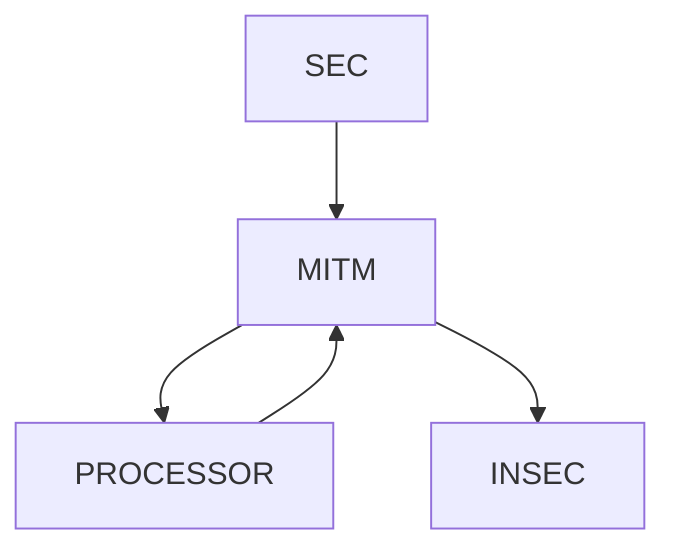
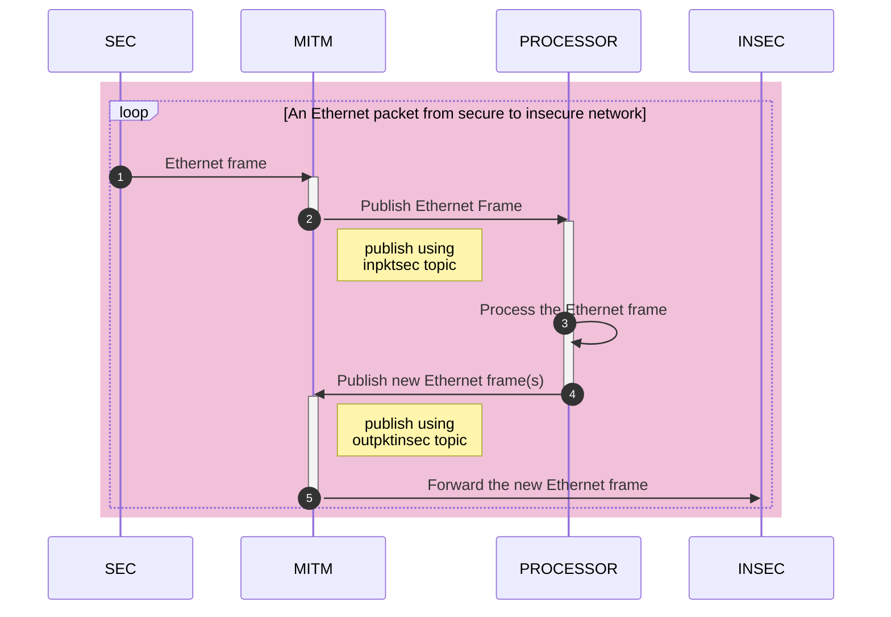
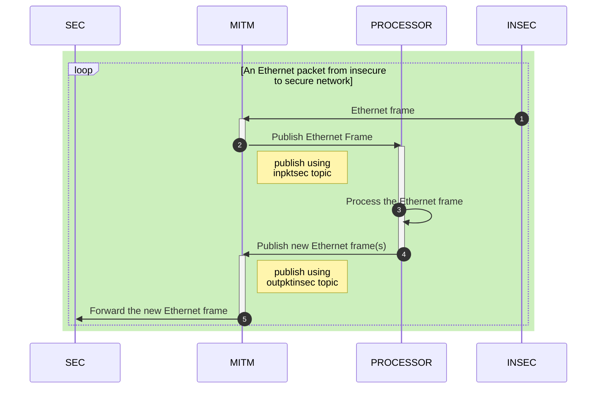

# Middlebox Development Environment

## Requirements

- Install docker and make sure that docker compose is available. The docker-compose.yml file is in the root folder of the project. 
- It is strongly suggested that you install VSCode and Docker extension thereof.
- Have a GitHub account

## Installation

You can access the public GitHub project at `https://github.com/cengwins/middlebox.git`

Fork the project and clone your forked project into your working directory, say `workspace`

## License

The project has GNU GENERAL PUBLIC LICENSE, Version 3, 29 June 2007. Please comply with this license.

## Running the development environment

- Enter the working directory `cd workspace; code .`
- Open a terminal and run `docker compose up -d`
- A couple of containers will be run and you will be able to see the containers in the docker extension of vscode.
- Right clicking on a container will help you open a terminal to any container
    - **sec** models a secure network (a single host)
    - **insec** models an insecure network (a single host)
    - **mitm** models the man-in-the-middle box.
    - **go-process** models the packet processing logic.
    - **python-process** models the packet processing logic.

## Development

### Modelled Environment

The environment model is as follows.

- Under the code folder, there are specific folders to the *sec*, *insec*, *mitm* and *go-process* containers. These folders are there to make your coding persist even when you stop your containers. Please create a folder under the `code` folder with a meaninfull and easy-to-understand and brief name.
- Create a folder using the same folder name in the root folder of the project and create a Dockerfile. An example is provided in `./go-processor`. The Dockerfile has to set the workdir correctly for convenience and you have to install the development environment specific to the programming language of your choice. Do not forget to install the NATS development modules or packages if required.
- Add a new service to the docker-compose.yml. An example is there for the `go-processor`. **TODO**
- We use [NATS](https://nats.io) as the message broker. NATS supports various programing languages (C, Python, Go, Rust, Java, Ruby, etc.).
- The *mitm* container works inline, i.e., the packet is captured, processed (by you) and then forwarded. You have to explicity, push the Ethernet frame or frames using NATS to the correct out* topics that will be captured by the *mitm* container and forwared to a network indicated by the topic name. An example processor is provided in go-processor.
- The mitm publishes the captured Ethernet frames on two topics and listens on two topics
    * Published topics
        - **inpktsec**: An Ethernet frame that comes from the **secure** network to the mitm.
        - **inpktinsec**: An Ethernet frame that comes from the **insecure** network to the mitm.
    * Subscribed topics
        - **outpktsec**: If you generated an Ethernet frame (only Ethernet is supported) to be forwarded to the **secure** network.
        - **outpktinsec**: If you generated an Ethernet frame (only Ethernet is supported) to be forwarded to the **insecure** network.
- Your processor has to subscribe to inpktsec and inpktinsec topics for processing up-stream (secure to insecure) and down-stream (insecure to secure) packets.
- When you want to forward the packet to the host on the secure network, publish the Ethernet frame using the topic, **outpktsec**.
- When you want to forward the packet to the host on the insecure network, publish the Ethernet frame using the topic, **outpktinsec**.

### Packet from Secure Network to Insecure Network

Based on this architecture, any Ethernet frame originated from the secure network (SEC) is first captured by the Man-in-the-Middle (MITM) container. Routing is disabled by default. A simple switch code is run here. Note that, the interfaces of the MITM has MAC/IP addresses, that is why the MITM is not transparent. MITM publishes the Ethernet frame to **inpktsec** topic using NATS. We expect that the PROCESSOR have had subscribed to this topic in advance. It will process the Ethernet frame (e.g., add delay, change some fields, or even multiple new Ethernet frames can be generated) and then publishes the Ethernet frame to the **outpktinsec** topic to help MITM to forward the packet to the correct network. You can also publish using **outpktsec** but this may not work as expected if the MAC addresses are not adjusted correctly. The processor, in general, does not have to deal with the MAC addresses; the MITM will set the correct destionation MAC address based on the topic it receives the Ethernet frame(s) published by the PROCESSOR. Note that, you can form a chain of processors by your self, by creating new NATS topics; as expected the last PROCESSOR in the chain should propagate the Ethernet frame back to MITM so that it can switch it.

### Packet from Insecure to Secure Network

A packet may originate from the insecure network to the secure network. The same operation is conducted in reverse direction. 

# Disclaimer

The following sources are leveraged for building this project:
- https://github.com/MaxXor/raw-sockets-example/blob/master/rawsockets.c
- https://github.com/MaxXor/raw-sockets-example/blob/master/rawsockets.c
- NATS documentation

